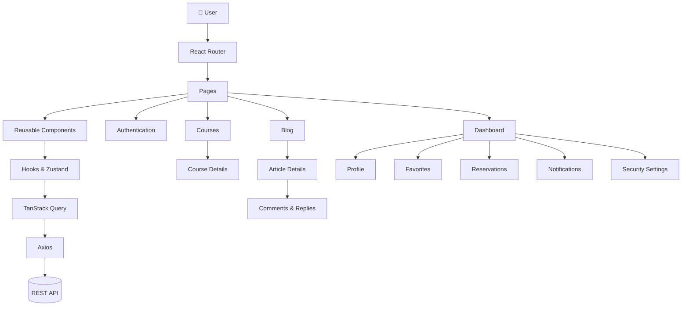

<div align="center">

# 🚀 Nova

 
### Modern Programming E-Learning Platform

*A collaborative learning platform for discovering programming courses, reading educational articles, tracking learning progress, and delivering a modern user experience.*

<br>


<br>


<br>

**Programming Courses • Educational Blog • Interactive Dashboard • Responsive Design**

</div>

## 📑 Table of Contents

- [About](#user-content--about)
- [Highlights](#user-content--highlights)
- [Features](#user-content--features)
- [Tech Stack](#user-content--tech-stack)
- [Application Architecture](#user-content-️-application-architecture)
- [Screenshots](#user-content--screenshots)
- [Getting Started](#user-content--getting-started)
- [Project Structure](#user-content--project-structure)
- [Team](#user-content--team)

 
## 📖 About

**Nova** is a modern web-based **Programming E-Learning Platform** designed to make learning programming more accessible, engaging, and interactive.

The platform enables users to discover programming courses, reserve courses, read educational articles, interact with instructors, and manage their learning journey through a personalized dashboard. It provides a smooth and intuitive experience while simplifying access to educational resources.

Built with a modern frontend architecture, Nova emphasizes performance, responsiveness, scalability, and maintainability to support future growth and feature expansion.

## 🌟 Highlights

- 🎓 Modern programming e-learning platform
- 📱 Fully responsive design
- 🌙 Dark mode support
- 🌍 Multi-language interface
- ⚡ Optimized with TanStack Query
- 🎙️ Integrated voice assistant
- 💬 Real-time chat system
  
## ✨ Features

### 🎓 Learning Experience

* Explore programming courses with comprehensive details
* Reserve courses for future enrollment
* Search, filter, sort, and paginate course listings
* Rate courses and discover related learning content
* Save favorite courses for quick access

---

### 📰 Educational Blog

* Read educational articles across various programming topics
* Browse articles by category
* Like and rate blog posts
* Participate in discussions through comments and replies
* Save favorite articles

---

### 👨‍💻 Personalized Dashboard

* Manage personal profile and account information
* Access reserved courses
* Organize favorite courses and blog posts
* View notifications and activity history
* Manage account security settings

---

### 🚀 Smart Learning Tools

* Assess programming skills through an interactive level assessment
* Use the integrated voice assistant for a more interactive experience
* Communicate through the built-in chat system

---

### 🔐 Authentication & Security

* User registration and login
* OTP verification
* Password recovery and reset
* Secure account management

---

### 🎨 Modern User Experience

* Fully responsive design
* Dark mode support
* Multi-language interface
* Clean and intuitive user interface
* Reusable component-based architecture
* Optimized performance for a smooth user experience


## 🛠 Tech Stack

Nova is built using a modern frontend ecosystem that prioritizes scalability, maintainability, and performance.

| Category                    | Technologies                                                            |
| :-------------------------- | :---------------------------------------------------------------------- |
| **Frontend**                | React 19, Vite (Rolldown)                                               |
| **Language**                | JavaScript (ES6+)                                                       |
| **Styling**                 | Tailwind CSS v4, HeroUI, DaisyUI                                        |
| **Routing**                 | React Router DOM                                                        |
| **State Management**        | Zustand, React Context API                                              |
| **Data Fetching**           | Axios, TanStack Query                                                   |
| **Forms & Validation**      | React Hook Form, Zod, Yup                                               |
| **Internationalization**    | i18next, React i18next                                                  |
| **Animations**              | Framer Motion                                                           |
| **Real-time Communication** | Socket.IO Client                                                        |
| **Maps**                    | Leaflet, React Leaflet                                                  |
| **UI Enhancements**         | Swiper, React Icons, React Hot Toast, React Toastify, Typewriter Effect |

## 🏗️ Application Architecture



## 📸 Screenshots

Explore the user interface of **Nova** through some of its main pages.

### 🏠 Landing Page

> The main entry point of the platform, introducing featured courses, instructors, and educational content.

<p align="center">

</p>

---

### 🎓 Courses

> Browse programming courses with filtering, searching, and detailed information.

<p align="center">

</p>

---

### 📖 Course Details

> Explore complete course information, instructor details, comments, and related courses.

<p align="center">

</p>

---

### 📰 Educational Blog

> Read articles, discover programming topics, and participate in discussions.

<p align="center">

</p>

---

### 👤 User Dashboard

> Manage profile, reservations, favorites, notifications, and account settings.

<p align="center">

</p>

## 🚀 Getting Started

Follow the steps below to run the project locally.

### Prerequisites

Make sure you have the following installed:

* **Node.js** (v20 or later recommended)
* **npm** (or another compatible package manager such as pnpm)

---

### Clone the Repository

```bash
git clone https://github.com/react-summer-1404/Nova.git
```

---


### Install Dependencies

```bash
npm install
```

---

### Configure Environment Variables

Create a `.env` file in the project root and add the required environment variables.

```env
VITE_API_BASE_URL=https://sepehracademy.liara.run
```

> Contact the backend team if you need access to the API endpoints or environment configuration.

---

### Start the Development Server

```bash
npm run dev
```

The application will be available at:

```text
http://localhost:5173
```

---

### Build for Production

```bash
npm run build
```

---

### Preview the Production Build

```bash
npm run preview
```

## 📂 Project Structure

The project follows a modular and scalable architecture to improve maintainability and collaboration.

```text
src
│
├── assets/          Static assets (images, icons, fonts, etc.)
├── components/      Reusable UI components shared across the application
├── configs/         Global application configuration
├── constants/       Shared constants and static values
├── context/         React Context providers
├── features/        Feature-specific modules (Authentication, Chat, Voice Assistant, etc.)
├── hooks/           Custom React hooks
├── layouts/         Shared page layouts
├── pages/           Route-level pages
├── router/          Application routing configuration
├── services/        API services and server communication
├── store/           Global state management (Zustand)
├── styles/          Global styles
├── utils/           Utility and helper functions
└── main.jsx         Application entry point
```
## 🤝 Team

Nova was collaboratively developed by a team of developers as an educational software project.

The project reflects a collaborative effort in designing, implementing, and integrating different parts of a modern programming e-learning platform.

---
<div align="center">

Made with ❤️ by **Nova Team**

⭐ If you like this project, consider giving it a star on GitHub.

</div>
